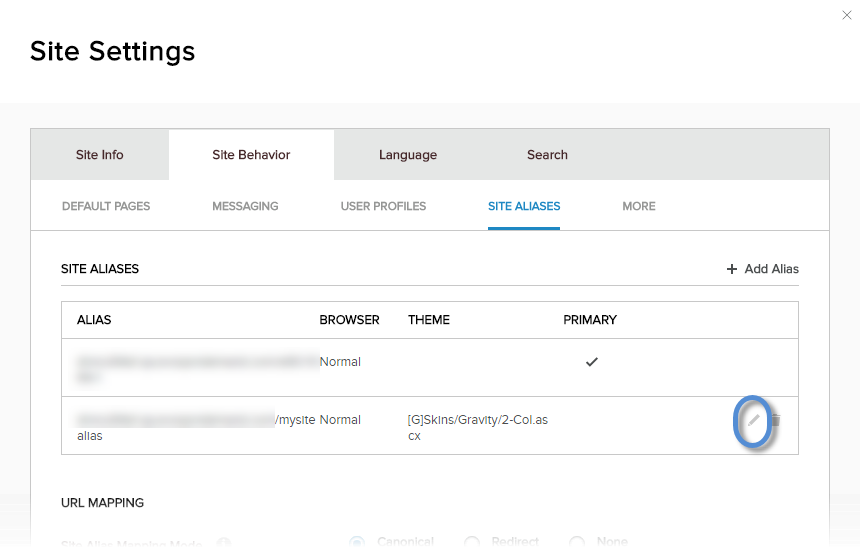
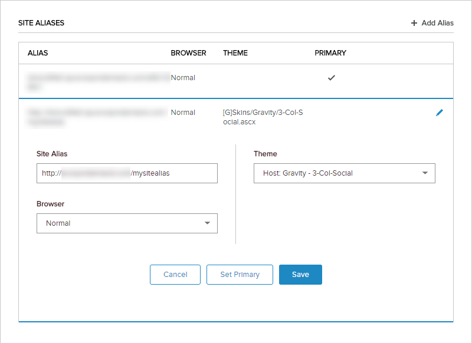

# Edit a Site Alias

Note: The current site alias cannot be edited, deleted, or set as primary. Log into the site using a different site alias to edit or delete the currently used alias.

## Prerequisites

*   **A host / super user account.** Hosts have full permissions to all sites in the DNN instance.

## Steps

1.  Go to Persona Bar \> Settings \> Site Settings.
    
    
    
    ➊
    
    ➋
    
2.  Go to the Site Behavior tab, and then the Site Aliases subtab.
    
    
    
3.  Click/Tap the pencil icon for the site alias.
    
      
    
    
    
      
    
4.  Configure the properties of the site alias.
    
      
    
    
    
      
    
    Field
    
    Description
    
    Site Alias
    
    The alternative URL (without the protocol) which can be used to access the same site.
    
    Browser
    
    *   Normal. If the site alias is intended for normal web browsers.
    *   Mobile. If the site alias is intended for mobile devices.
    
    Theme
    
    The site theme to use if the site is accessed with this alias.