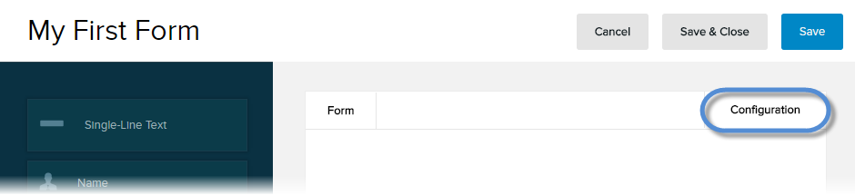

# Save Form Responses to Structured Content

DNN provides a connector that links the Form Builder microservice with the Structured Content microservice. With this connector, you can save pieces of a response to a form as a structured content, which you can then reuse. Example: If your website uses a form to collect reviews and ratings from your readers, you can save those reviews and ratings in the Structured Content microservice to be published in another page in your website.

## Prerequisites

**Both the Form Builder and the Structured Content microservices must be enabled for your site.**

## Steps

1.  Go to Persona Bar \> Content \> Forms.
    
    
    
    ➊
    
    ➋
    
2.  Create or edit a form.
    *   [Create a form.](create-form)
    *   [Edit a form.](edit-form)
3.  Click/Tap the Configuration tab.
    
      
    
    
    
      
    
4.  Go to the Data Collection tab.
    
      
    
    
    
      
    
5.  Click/Tap the Configure button for Evoq Content Type.
6.  Choose the content type for the new content items that will hold data from the form submissions. Then click/tap Save & Configure.
    
      
    
    
    
      
    
7.  Fill in the content item information.
    
      
    
    
    
      
    
    Field
    
    Description
    
    Content Item Name
    
    Choose the form field to use as the content item name.
    
    Content Item Tags
    
    Tags to associate with the created content items.
    
    Content Item Description
    
    The description for each content item created.
    
8.  Under Configure Content Type Fields from Form (Mapping), choose the equivalent form field for every content type field.
    
      
    
    