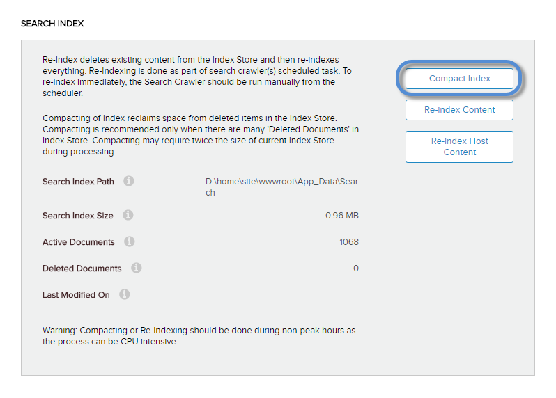

# Compress the Indexes

Note: Compressing indexes or reindexing are CPU-intensive processes and should, therefore, be run during off-peak hours.

## Prerequisites

*   **An administrator account for the site.** Administrators have full permissions to the specific site.

## Steps

1.  Go to Persona Bar \> Settings \> Site Settings.
    
    
    
    ➊
    
    ➋
    
2.  Go to the Search tab, and then the Basic Settings subtab.
    
    
    
3.  In Search Index, click/tap Compact Index.
    
      
    
    