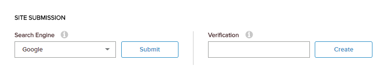

# Configure Your Sitemap

## Steps

1.  Go to Persona Bar \> Settings \> SEO.
    
    
    
    ➊
    
    ➋
    
2.  Go to the Sitemap Settings tab.
    
      
    
    
    
      
    
3.  Update the General Sitemap Settings.
    
      
    
    
    
      
    
    Field
    
    Description
    
    Sitemap URL
    
    The location of the sitemap.
    
    Exclude URLs With a Priority Lower Than
    
    The lowest priority to include in the sitemap.
    
    Include Hidden Pages
    
    If enabled (On), pages that are not visible in the menu are also included in the sitemap.
    
    Days to Cache Sitemap For
    
    The number of days before the sitemap is regenerated. If set to Disable Caching, the sitemap is regenerated, only when requested.
    
    Tip: If you have a large site (i.e., at least 50,000 URLs), cache the sitemap for at least one day to help improve your site's performance.
    
    Clear Cache
    
    Click/Tap to delete all cached sitemaps. A new sitemap is generated at the next request.
    
    Minimum Priority for Pages
    
    If Use page level based priorities? is checked, the lowest priority to assign to pages. Example, if the minimum priority is 0.7,
    
    *   Root/Level 1 gets a priority of 1.0.
    *   Level 2 gets a priority of 0.9.
    *   Level 3 gets a priority of 0.8.
    *   Level 4 and all lower levels get a priority of 0.7.
    
    Use Page Level Based Priorities
    
    If enabled (On), the priority for each page is computed based on its hierarchy level. Top level pages are assigned a priority of 1.0, and lower levels are 0.1 less than the next higher level (i.e., the second level pages are assigned a priority of 0.9; the third level, 0.8).
    
4.  Enable and configure the sitemap providers you want to use.
    
      
    
    
    
      
    
    Click/Tap the pencil icon in the first column of the table for the appropriate provider.
    
    Field
    
    Description
    
    Enable Sitemap Provider
    
    The order in which the providers would be used, if more than one provider is enabled.
    
    Override Priority
    
    The priority of the provider, if more than one provider is enabled. The sitemap generated by a provider with a higher priority is preferred over the sitemap generated by a provider with a lower priority.
    
5.  Click/Tap Save.

  

  

6.  (Optional) [Submit your site to Google Search for indexing.](submit-site-Google-search)
7.  (Optional) Submit your site to Bing for indexing.
    
    1.  Choose Bing from the Search Engine dropdown.
    2.  Click/Tap Submit.
    
    You will be directed to Bing's site for webmasters.
    
8.  (Optional) Submit your site to Yahoo! for indexing.
    
    1.  Choose Yahoo! from the Search Engine dropdown.
    2.  Click/Tap Submit.
    
    You will be directed to Yahoo!'s site for webmasters.