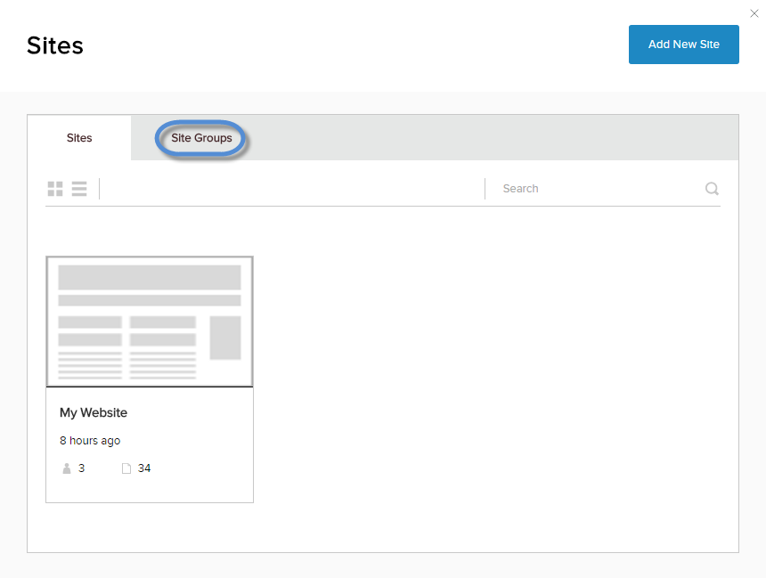
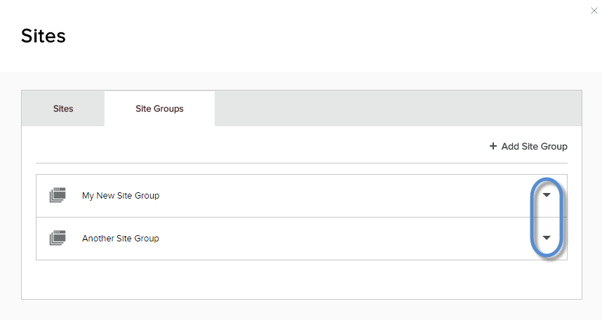
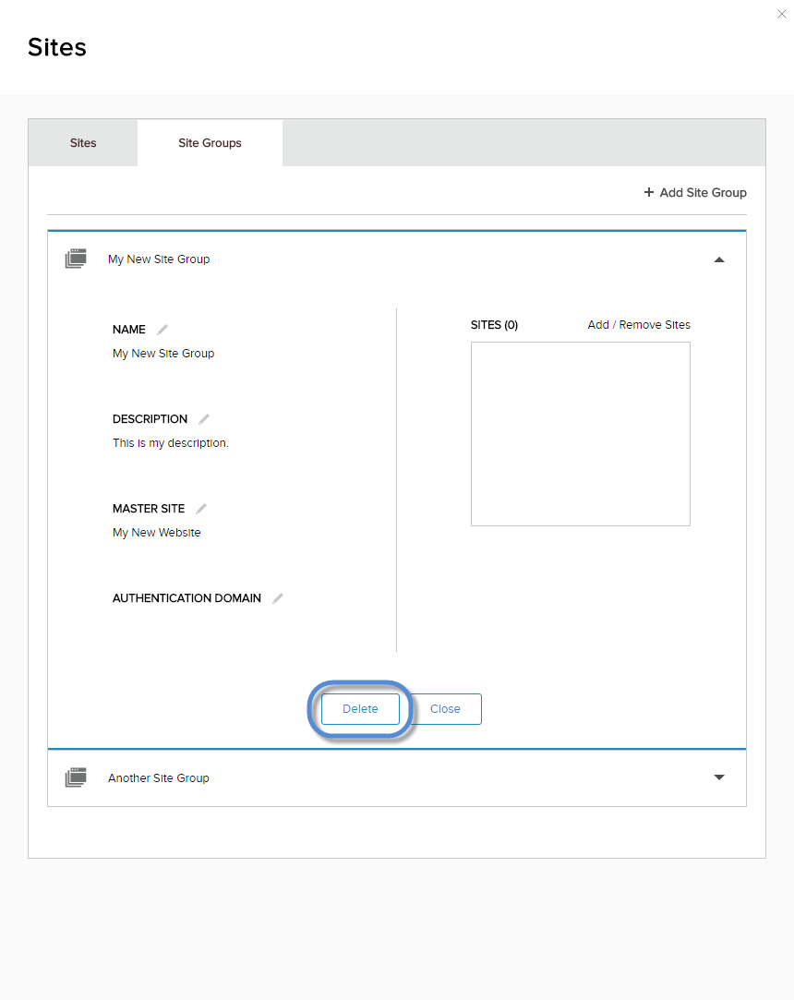

# Delete Site Group

## Prerequisites

*   **A host / super user account.** Hosts have full permissions to all sites in the DNN instance.

## Steps

1.  Go to Persona Bar \> Manage \> Sites .
    
    
    
    ➊
    
    ➋
    
2.  Go to the Site Groups tab.
    
      
    
    
    
      
    
3.  Locate the site group from the list. Then click/tap the arrow to expand it.
    
      
    
    
    
      
    
4.  Click/Tap the Delete button.
    
      
    
    
    
      
    
5.  Confirm.