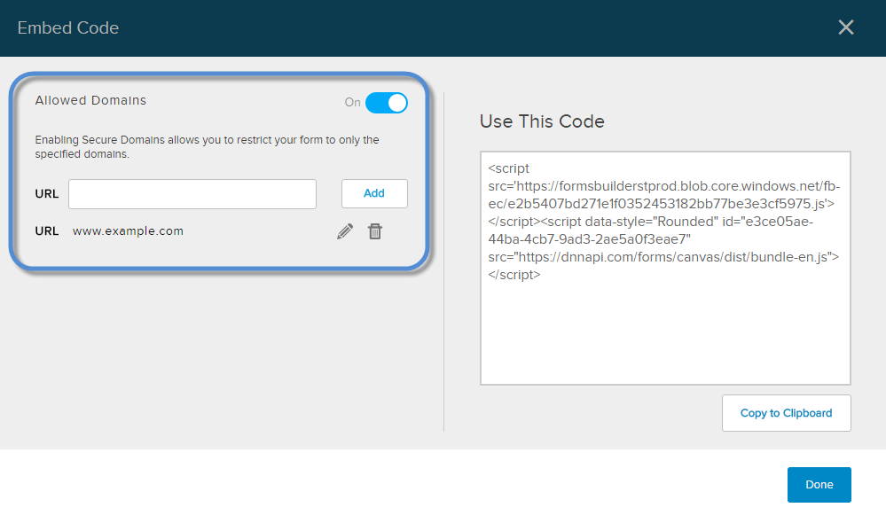

# Embed a Form

You can embed a form on any webpage or app.

## Steps

1.  Click/Tap the ellipses for the form you want, and choose Embed.
    
      
    
    
    
      
    
2.  Choose the design style for the form.
    
      
    
    
    
      
    

3.  (Optional) Restrict the domains where the form can be accessed.
    
      
    
    
    
      
    
    1.  Enable Allowed Domains.
    2.  To add a new URL, enter the URL and click/tap Add.
    3.  To edit a URL in the list, click/tap the pencil icon for that URL.
    4.  To delete a URL in the list, click/tap the trash icon for that URL.
4.  Copy the embed code under the Use This Code section and paste it to your webpage or app.
    
      
    
    