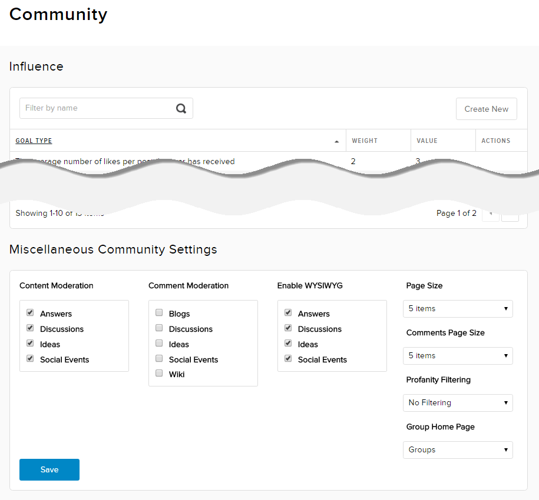

# Configure Other Community Settings

## Prerequisites

**A community manager account for the site.** Community managers have access to community-related features and settings in Evoq Engage.

## Steps

1.  Go to Persona Bar \> Settings \> Community.
    
    
    
    ➊
    
    ➋
    
2.  Configure the community settings.
    
      
    
    
    
      
    
    Field
    
    Description
    
    Content Moderation
    
    Content of the checked type(s) are moderated before they are published.
    
    Comment Moderation
    
    Comments for items of the checked type(s) are moderated before they are published.
    
    Enable WYSIWYG
    
    The WYSIWYG editor is enabled when users create or edit items of the checked type(s).
    
    Page Size
    
    The number of items to display in each result page.
    
    Comments Page Size
    
    The number of comments to display in item.
    
    Profanity Filtering
    
    *   Filter Content. Words included in a profanity list are automatically removed from the content before publication.
    *   Prohibit Content. Members are not allowed to add content.
    *   No Filtering. All content submitted by members are published without filters.
    
    Group Home Page
    
    The landing page for the group.