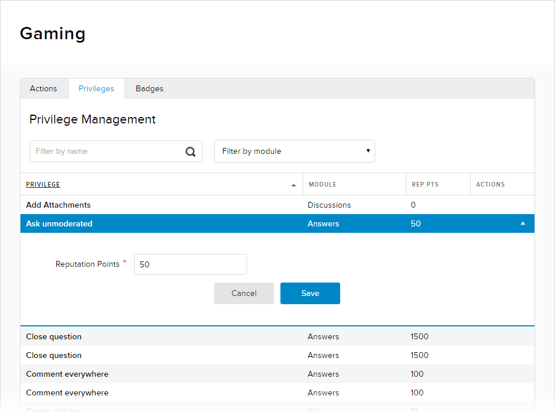

# Configure Gaming Privileges

## Prerequisites

**A community manager account for the site.** Community managers have access to community-related features and settings in Evoq Engage.

## Steps

1.  Go to Persona Bar \> Settings \> Gamification.
    
    
    
    ➊
    
    ➋
    
2.  In the Privileges tab, highlight the privilege to be edited, then click/tap the pencil icon under the Actions column.
    
      
    
    
    
      
    
3.  Configure the privilege.
    
      
    
    
    
      
    
    Field
    
    Description
    
    Reputation Points
    
    The minimum number of reputation points that a user must earn to get this privilege.