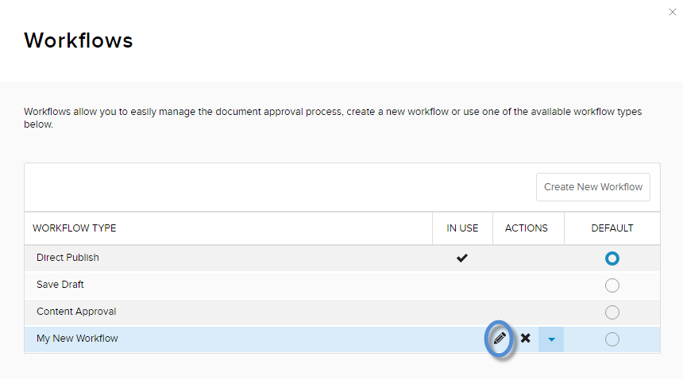

# Edit a Workflow

## Steps

1.  Go to Persona Bar \> Settings \> Workflow.
    
    
    
    ➊
    
    ➋
    
2.  In the list, hover over the workflow to edit. Then click/tap the pencil icon.
    
      
    
    
    
      
    
3.  Manage the workflow states.
    
    *   To add a state to the workflow, click/tap the Add a State button. Then configure the workflow state.
    *   To edit a custom state, click/tap the state's pencil icon in the Actions column. Then configure the workflow state.
    *   To delete a custom state, click/tap the state's X icon in the Actions column.
    *   To rearrange the order of the custom states, use the arrows in the Move column.
    
      
    
    