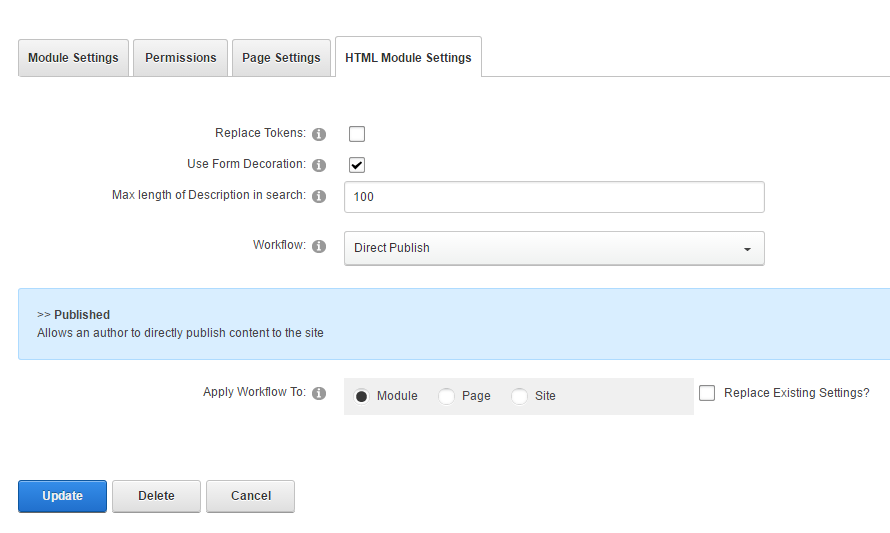

# Configure the HTML / HTML Pro (Text) Module

## Steps

1.  Go to the page containing the module to configure. Edit the page.
2.  In the module's action menu bar, go to Manage (gear icon) \> Settings.
    
      
    
    
    
      
    
3.  Go to the HTML Module Settings tab.
    
    HTML on DNN Platform:
    
      
    
    
    
      
    
    HTML Pro on DNN Evoq:
    
      
    
    
    
      
    
    Field
    
    Description
    
    Replace Tokens
    
    If checked, tokens in the HTML text are replaced.
    
    Note: If checked, inline editing and module caching are also disabled.
    
    Max Length of Description in Search
    
    The maximum number of single-byte characters from the text that are displayed in site search results.
    
     
    
    In DNN Platform only
    
    Use Form Decoration
    
    If checked, the HTML controls in the module's contents are decorated to match the style in other instances of the HTML module in the site.
    
    Workflow
    
    The predefined workflow to use for content creation using this module. Workflows are defined by content managers or administrators in the Workflow Management module.
    
    Apply Workflow To
    
    *   Module. The selected workflow is used only for the current instance of the module.
    *   Page. The selected workflow is used for all HTML module instances in the same page.
    *   Site. The selected workflow is used for all HTML module instances in the entire site.