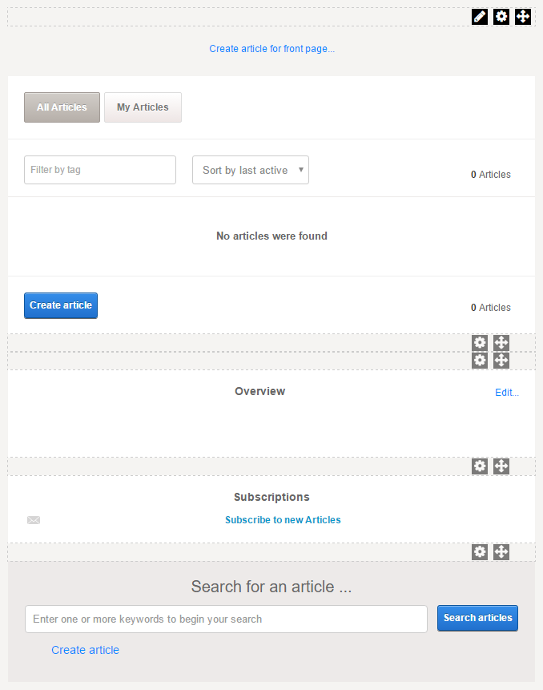

# Module: Wiki

Displays and manages a wiki within the site.

  

  

Companion modules are displayed automatically when the main module is added to a page and are configured separately.

*   Wiki Index. Displays the wiki's index terms, if any.
*   Wiki MetaData.
*   Wiki Subscriptions. Allows the user to subscribe to the wiki.
*   Wiki Search. Allows the user to search the wiki.

To display/hide companion module(s),

*   From the main module's action menu, go to Edit (pencil icon) \> Add Companion Modules....  
    
    
    
      
    
*   Check/Uncheck the Visible on Page box for the companion module that you want to be displayed/hidden.  
    
    
    
      
    

 

Package

Category

Product(s)

  

Wiki

Social

 