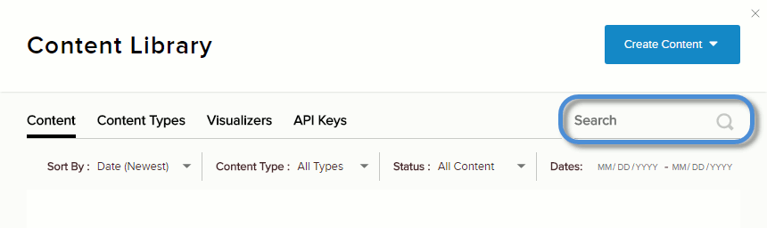

# Delete a Content Item

## Prerequisites

*   **Microservices must be enabled for your site.**

## Steps

1.  Go to the Content tab.
    
    
    
2.  Search for the content item in the list.
    
    You can use the Search field, the Sort By, or the filters (Content Type, Status, and Dates).
    
      
    
    
    
      
    
3.  Click/Tap the ellipses ... for the specific content item, and then select Delete.
    
      
    
    
    
      
    
4.  Confirm.